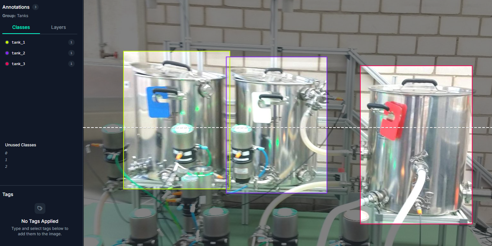
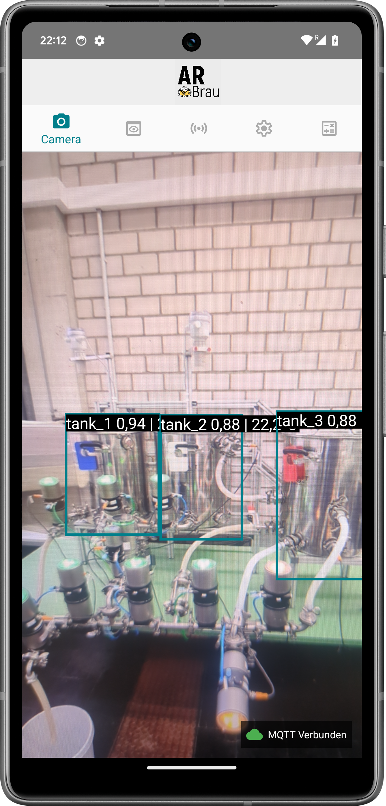
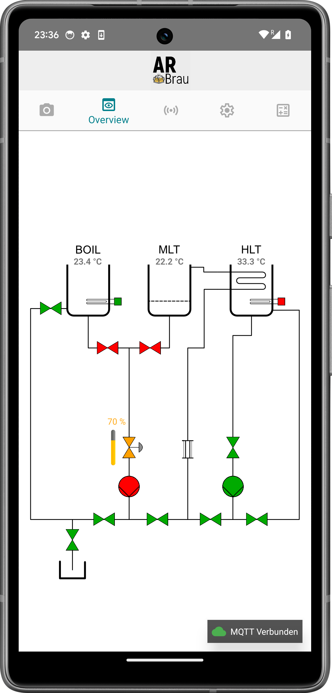
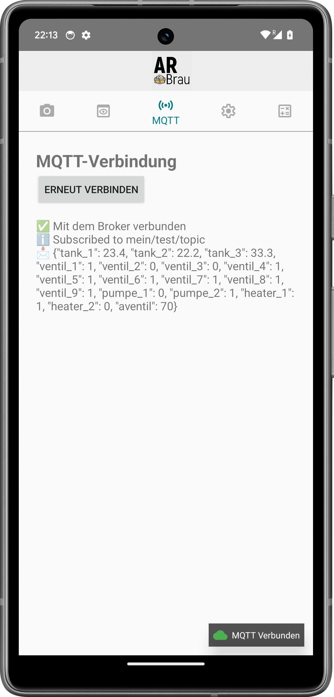
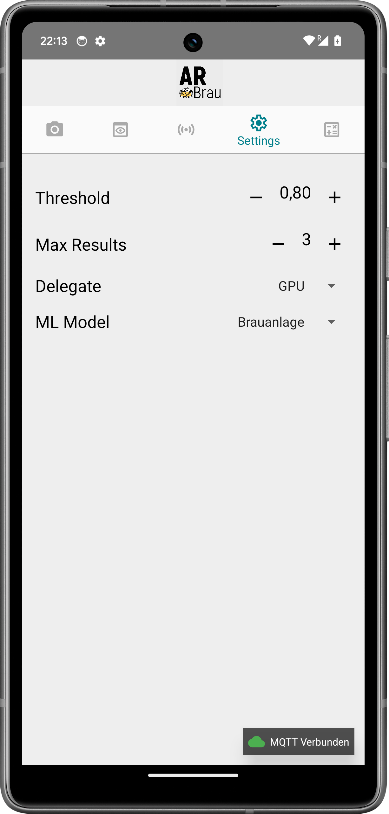
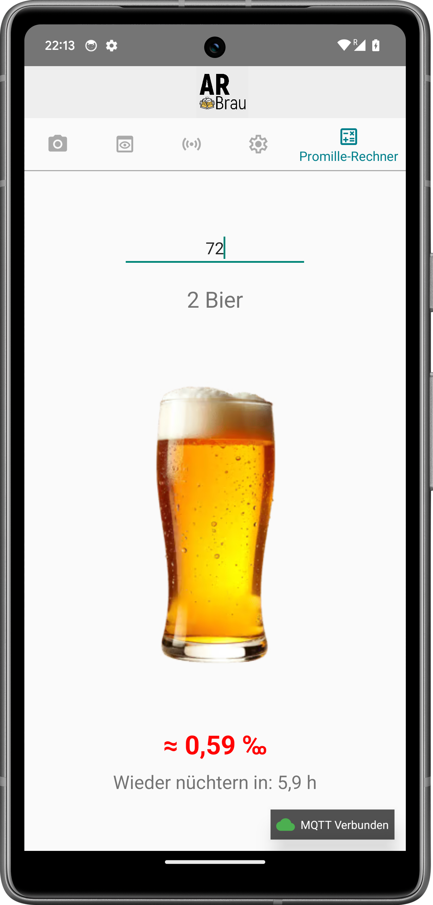

# Brauanlagen AR-App 📱
 
 
Dieses Projekt ist eine Android-App, die den Status einer Brauanlage visualisiert.  
Sie verbindet **Sensordaten über MQTT** mit einer benutzerdefinierten **Objekterkennung auf Kamerabildern** und bietet verschiedene Ansichten, um Tanks, Ventile und andere Komponenten zu überwachen.

---

## Features

- **Kamera-Ansicht**  
  - Live-Objekterkennung mit TensorFlow Lite  
  - Overlay zeigt zusätzlich Temperaturdaten der Tanks in Echtzeit  

- **Übersicht (Overview)**  
  - Visualisierung aller Pumpen, Ventile und Heizstäbe der Brauanlage  
  - Anzeige der aktuellen Temperaturwerte in den Tanks  
  - Ventile, Pumpen und Heizstäbe ändern ihre Farbe (rot = aus, grün = an, grau = unbekannt)  

- **MQTT-Integration**  
  - Empfang von Sensordaten (Temperaturen, Ventilzustände etc.) über einen Raspberry PI als MQTT-Broker  
  - Live-Anzeige von Nachrichten und Verbindungsstatus (verbunden / getrennt / Fehler)  

- **Einstellungen**  
  - Konfiguration von Objekterkennungs-Parametern:  
    - Confidence Threshold  
    - Max. Ergebnisse  
    - Delegate (CPU / GPU)  
    - Modellwahl (z. B. Tanks-Modell)  

- **Promille-Rechner 🍻**  
  - Berechnung des geschätzten Blutalkoholwerts auf Basis der Anzahl konsumierter Biere und des Körpergewichts  
  - Anzeige der voraussichtlichen Zeit bis zur vollständigen Nüchternheit  

---

## Architektur

- **Single-Activity-App** mit `MainActivity` und Navigation über `BottomNavigationView`  
- **Fragments** für die einzelnen Tabs:  
  - `CameraFragment` – Objekterkennung & Overlay  
  - `OverviewFragment` – Gesamtanlage mit Ventilen/Pumpen/Heizstäben  
  - `MQTTFragment` – Log & Status der MQTT-Nachrichten  
  - `SettingsFragment` – Konfiguration der Objekterkennung  
  - `PromilleFragment` – Promille-Rechner
 
  <p float="left">
  
  
  
  
  
</p>
  
---

## ⚙️ Installation & Start

1. Projekt in **Android Studio** öffnen.  
2. Dependencies syncen (`Gradle`).  
3. MQTT-Broker-Adresse im `MainViewModel` anpassen:  

   ```kotlin
   private val brokerUri = "tcp://XXXXXXXXXX:1883"
   private val topic = "brauanlage/data"
